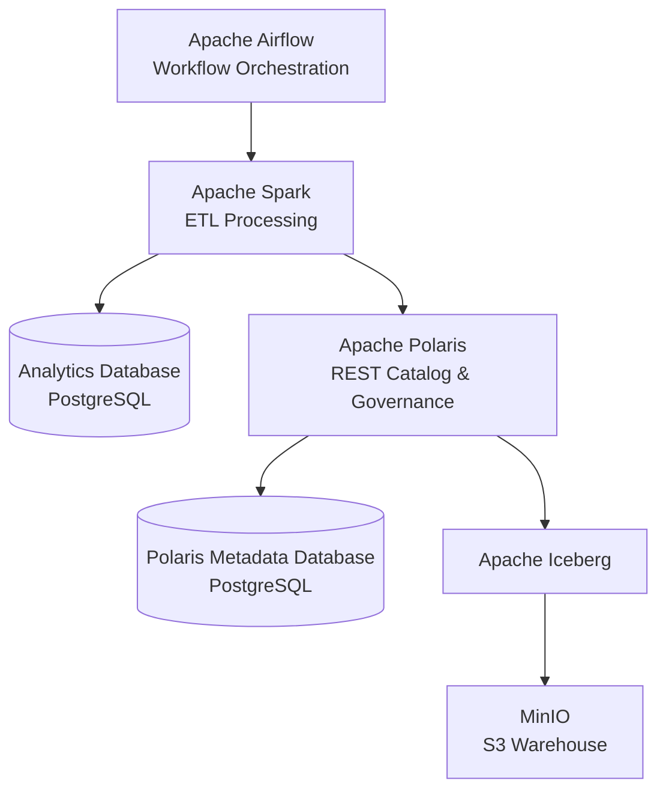
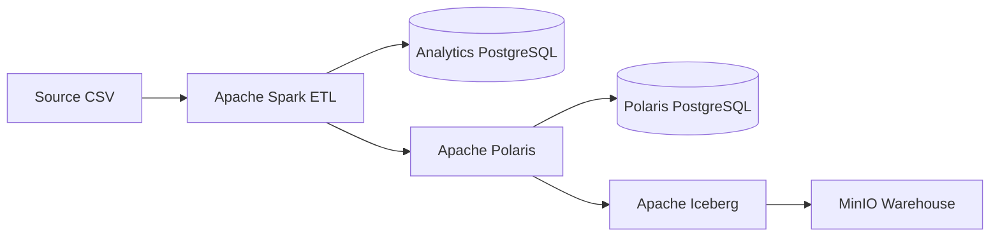

# 🚀 Modern Data Lakehouse Platform with Apache Iceberg & Apache Polaris


> A production-inspired Data Lakehouse platform built using **Apache Spark, Apache Iceberg, Apache Polaris, PostgreSQL, MinIO, and Apache Airflow**.

This project demonstrates how modern Lakehouse platforms separate **compute**, **storage**, **metadata**, and **governance** into independent services. Instead of focusing only on Apache Iceberg, the project explores how Spark, Polaris, PostgreSQL, MinIO, and Airflow work together to build a scalable and governed analytics platform.

---

# 🎯 Objectives

The primary goals of this project are:

- Build an end-to-end ETL platform using Apache Spark
- Learn Apache Iceberg internals and REST Catalog architecture
- Explore Apache Polaris for centralized metadata management and governance
- Store Iceberg data in S3-compatible object storage (MinIO)
- Persist governance metadata using PostgreSQL
- Orchestrate ETL workflows with Apache Airflow
- Simulate a production-inspired Lakehouse environment locally using Docker Compose

---

# 🏗 Architecture



---

# ⚙️ Technology Stack

| Layer | Technology |
|--------|------------|
| Data Processing | Apache Spark 3.5 |
| Programming Language | Scala 2.12 |
| Table Format | Apache Iceberg 1.9 |
| REST Catalog & Governance | Apache Polaris |
| Object Storage | MinIO |
| Metadata Store | PostgreSQL |
| Workflow Orchestration | Apache Airflow |
| Build Tool | SBT |
| Containerization | Docker Compose |

---

# 🧩 Platform Components

## Apache Spark

Spark performs the ETL processing by reading source data, transforming it, and writing the output to PostgreSQL and Apache Iceberg.

---

## Apache Iceberg

Apache Iceberg provides the table format and enables features such as:

- ACID Transactions
- Snapshot-based metadata
- Schema Evolution
- Time Travel
- REST Catalog integration

---

## Apache Polaris

Apache Polaris serves as the centralized REST Catalog and governance layer.

Responsibilities include:

- OAuth Authentication
- Catalog Management
- Namespace Management
- Table Registration
- Metadata Governance
- Authorization

Polaris is backed by a dedicated PostgreSQL database that persists governance metadata including catalogs, principals, roles, grants, and namespaces.

---

## PostgreSQL

The platform uses two PostgreSQL databases.

| Database | Purpose |
|----------|---------|
| Analytics Database | Stores business/application data generated by Spark ETL |
| Polaris Metadata Database | Stores governance metadata such as catalogs, principals, roles, namespaces, and grants |

---

## MinIO

MinIO provides S3-compatible object storage and acts as the Iceberg warehouse.

It stores:

- Iceberg Metadata
- Snapshot Files
- Manifest Files
- Parquet Data Files

---

## Apache Airflow

Airflow orchestrates the ETL workflow by scheduling and executing Spark jobs.

---

# 🔄 Data Flow



---

# 🚀 Features

- End-to-end Spark ETL pipeline
- Apache Iceberg REST Catalog integration
- Apache Polaris governance
- OAuth authentication
- Persistent PostgreSQL backend for Polaris
- MinIO S3-compatible object storage
- Dockerized multi-service deployment
- Apache Airflow orchestration
- Iceberg table creation and data ingestion

---

# 📂 Project Structure

```text
ELT-Pipeline-with-Docker-Compose

├── airflow/
│   ├── dags/
│   └── logs/
│
├── spark-scala-project/
│   ├── src/
│   └── build.sbt
│
├── spark-runner/
│
├── data/
│
├── docker-compose.yml
│
└── README.md
```

---

# ▶️ Running the Project

### Clone Repository

```bash
git clone https://github.com/ganeshsa986/ELT-Pipeline-with-Docker-Compose.git

cd ELT-Pipeline-with-Docker-Compose
```

### Start Services

```bash
docker compose up -d
```

### Build Spark Application

```bash
cd spark-scala-project

sbt clean assembly
```

### Trigger ETL

Open Airflow:

```
http://localhost:8090
```

Trigger the ETL DAG.

---

# 🧠 Key Learnings

Through this project I gained hands-on experience with:

- Modern Data Lakehouse Architecture
- Apache Spark ETL
- Apache Iceberg Internals
- Apache Polaris REST Catalog
- OAuth Authentication
- Metadata Management
- Data Governance Concepts
- Object Storage using MinIO
- Docker-based Infrastructure
- Workflow Orchestration using Airflow

---

# 🗺 Roadmap

### Governance

- [ ] Multiple Catalogs
- [ ] Multiple Principals
- [ ] Service Accounts
- [ ] Role-Based Access Control (RBAC)
- [ ] Namespace Permissions
- [ ] Table-Level Permissions

### Apache Iceberg

- [ ] Schema Evolution
- [ ] Partition Evolution
- [ ] Time Travel
- [ ] Snapshot Expiration
- [ ] Compaction

### Query Engines

- [ ] Trino Integration
- [ ] DuckDB Integration
- [ ] dbt Integration

### Cloud Deployment

- [ ] AWS S3
- [ ] AWS IAM
- [ ] AWS Secrets Manager
- [ ] Kubernetes Deployment

---

---

# 💡 Motivation

The goal of this project is to understand how modern enterprise data platforms are built beyond simply processing data.

By integrating Apache Spark, Apache Iceberg, Apache Polaris, PostgreSQL, MinIO, and Airflow, this project demonstrates how compute, storage, metadata, and governance work together to create a scalable, production-inspired Data Lakehouse.

---

## ⭐ If you found this project interesting, feel free to give it a star!